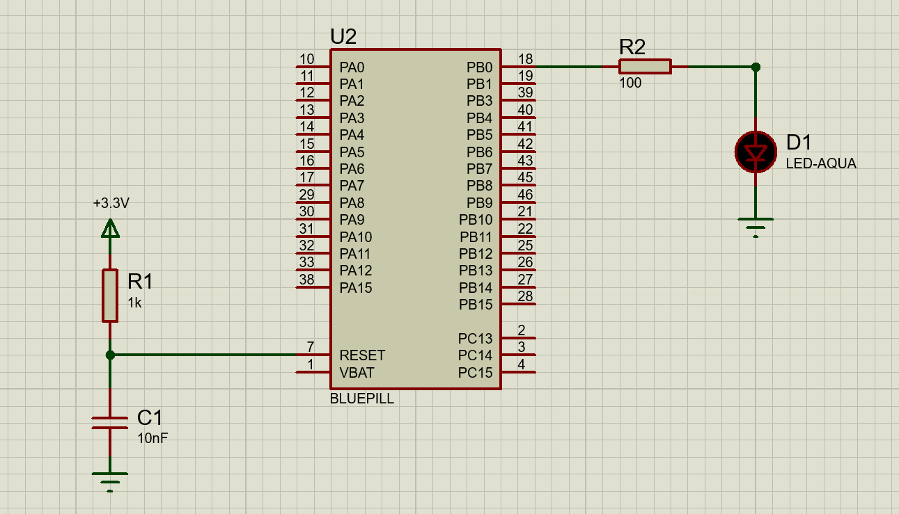
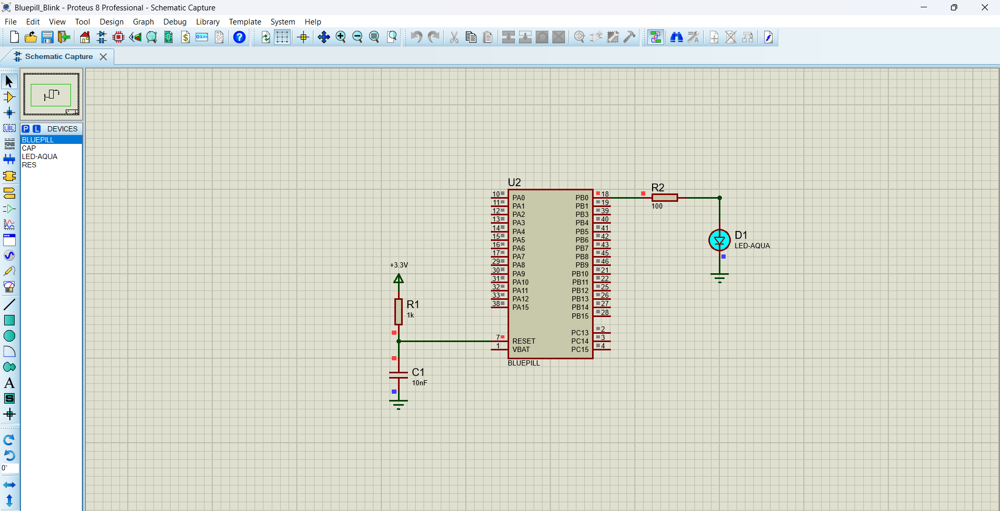

# stm32-gpio-starter

A minimal STM32CubeMX + HAL project to blink an LED using GPIO on STM32F103C8T6.  
Designed to be a clean starter template for embedded firmware projects.

---

## 🔧 Features

- STM32F103C8T6 (Blue Pill board)
- HAL-based GPIO toggling
- STM32CubeMX-generated initialization code
- Easily extendable to include UART, ADC, Timers, etc.
- Simulatable in Proteus for those without hardware

---

## 📌 Pin Configuration

| Function | Pin       |
|----------|-----------|
| LED      | PC13      |

---

## 🚀 Getting Started

1. Open the `.ioc` file in STM32CubeMX
2. Generate code (STM32 HAL)
3. Build using STM32CubeIDE
4. Flash via ST-Link or simulate in Proteus

---

## 🖼️ Screenshots

  

  

---

## 📂 Folder Structure

stm32-gpio-starter/ 
├── Core/ 
├── Drivers/ 
├── .ioc 
├── README.md 
